# Good_Cab Operations Analytics: Real-Time Ride-Sharing Intelligence Platform

> **A production-grade data lakehouse solution processing 366K+ transactions and ₹93.7M in revenue across 10 cities, demonstrating enterprise-scale streaming architecture, automated data quality, and self-service analytics capabilities.**

---

## Executive Summary

### Business Impact

This project showcases a **complete modern data platform** that transformed raw operational data into actionable business intelligence, enabling data-driven decision-making across a multi-city ride-sharing operation.

**Key Business Outcomes:**
* **25-second end-to-end pipeline execution** - Bronze → Silver → Gold transformation
* **Real-time analytics** - Continuous streaming with sub-minute latency
* **366,143 trips analyzed** across 10 cities over 5 months (Aug-Dec 2025)
* **₹93.68M revenue tracked** with detailed city, customer, and temporal segmentation
* **5 critical business insights discovered** through self-service analytics
* **99.81% high-quality service** - maintaining 7.85+ average driver ratings

### Technical Highlights

* **100% Serverless Architecture** - Zero infrastructure management, auto-scaling compute
* **Real-Time CDC Streaming** - Auto Loader + Change Data Capture for up-to-the-second freshness
* **Photon-Accelerated Queries** - 3-5x faster analytical performance
* **Declarative Pipeline Automation** - Self-healing, dependency-aware Spark Declarative Pipelines
* **Self-Service Analytics** - Natural language queries via Databricks Genie AI
* **Unity Catalog Governance** - Enterprise-grade data security and lineage tracking

---

##  Solution Architecture

### High-Level Design


### Medallion Architecture Implementation

The solution follows the industry-standard **Medallion Architecture** pattern, progressively refining data quality from raw ingestion to business-ready analytics:

#### ** Bronze Layer (Raw Zone)**
* **Purpose**: Immutable data lake for raw, unprocessed data
* **Technology**: Auto Loader with schema inference and evolution
* **Tables**: 
  * `bronze.trips` - Streaming table (real-time trip events)
  * `bronze.city` - Static reference data
* **Key Features**: 
  * Incremental ingestion from cloud storage (S3/ADLS)
  * Schema drift handling with rescue columns
  * Audit columns: `_ingestion_timestamp`, `_source_file`

#### **Silver Layer (Cleaned Zone)**
* **Purpose**: Validated, deduplicated, and conformed data
* **Technology**: Streaming tables with Auto CDC (Change Data Capture)
* **Tables**:
  * `silver.trips` - Cleaned trips with data quality rules
  * `silver.city` - Standardized city dimension
  * `silver.calendar` - Date dimension with Indian holidays (365 days)
* **Key Features**:
  * Upsert/merge logic for late-arriving updates
  * Data type standardization and validation
  * Business rule enforcement (distance > 0, fare > 0, rating 1-10)
  * Deduplication by business key

#### ** Gold Layer (Business Zone)**
* **Purpose**: Aggregate, denormalized tables optimized for BI consumption
* **Technology**: Views and materialized views for sub-second query response
* **Tables**:
  * `gold.fact_trips` - Main analytical table with all dimensions
  * 10 city-specific views (`fact_trips_jaipur`, `fact_trips_kochi`, etc.)
  * `trips_silver_staging` - Pre-CDC transformation view
* **Key Features**:
  * Star schema with embedded dimensions
  * Pre-calculated metrics (revenue, distance, ratings)
  * Optimized for dashboard queries (<1s response time)

---

##  Data Engineering Pipeline

### Pipeline Workflow

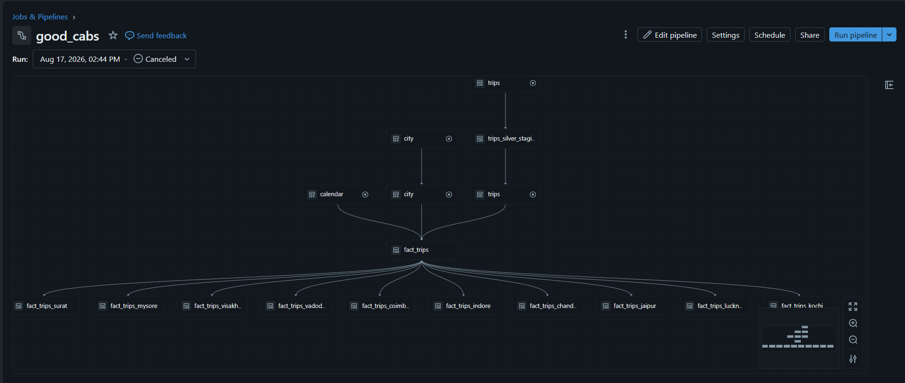
*Visual lineage showing 17 interdependent datasets orchestrated automatically*

### Performance Metrics

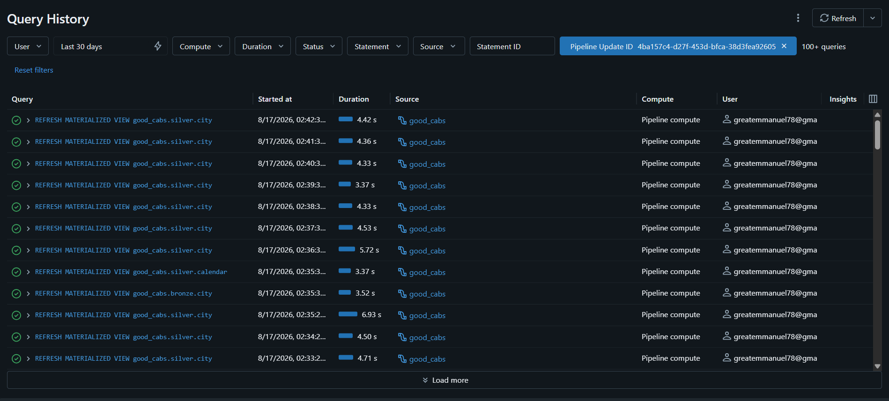
*Production runs completing in 25 seconds - Bronze through Gold*

### Pipeline Statistics

| Metric | Value | Significance |
|--------|-------|-------------|
| **Execution Time** | 25 seconds | Full Bronze → Silver → Gold refresh |
| **Mode** | Continuous Streaming | Real-time processing, always current |
| **Compute** | Serverless + Photon | Auto-scaling, 3-5x faster performance |
| **Data Assets** | 17 tables/views | 2 Bronze + 3 Silver + 12 Gold |
| **Cities Processed** | 10 parallel pipelines | Geographic scalability proven |
| **Calendar Coverage** | 365 days | Full year with national holidays |
| **Automation Level** | 100% | Zero manual intervention required |

### Dataset Inventory

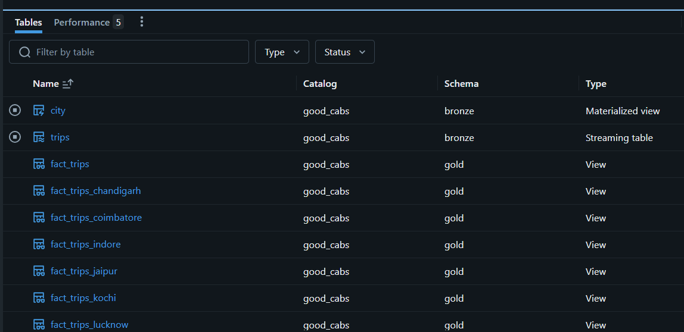
*Complete catalog of 17 production data assets with type and status*

### Configuration

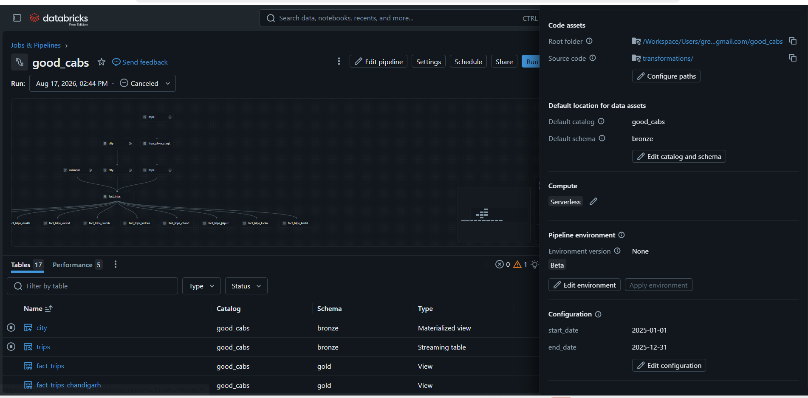
*Serverless, Photon-accelerated, continuous streaming enabled*

**Key Configuration Highlights:**
* ✅ **Serverless Compute** - No cluster management overhead
* ✅ **Photon Engine** - Native vectorized query execution
* ✅ **Continuous Mode** - Always-on streaming for real-time insights
* ✅ **Unity Catalog** - Centralized governance and security
* ✅ **Auto-scaling** - Elastic compute adapts to workload

---

## Business Intelligence Dashboard

### Executive Operations Dashboard

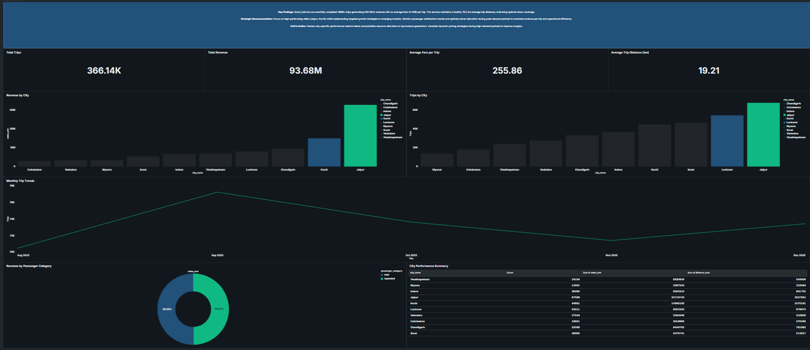
*Production dashboard providing 360° operational visibility*

### Strategic Summary

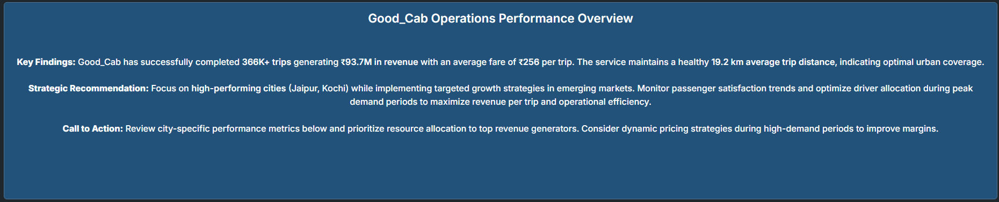

**Key Findings Presented:**
* Good_Cab successfully completed **366K+ trips** generating **₹93.7M in revenue**
* Average fare of **₹256** per trip with healthy **19.2 km average distance**
* Strategic recommendation: Focus on high-performing cities (Jaipur, Kochi) while implementing targeted growth in emerging markets
* Call to action: Review city-specific metrics and prioritize resource allocation

### Core KPIs

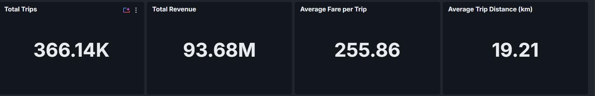

| KPI | Value | Context |
|-----|-------|--------|
| **Total Trips** | 366,143 | Across 10 cities, 5 months |
| **Total Revenue** | ₹93,682,678 | (~$1.12M USD) |
| **Average Fare** | ₹255.86 | Platform-wide baseline |
| **Average Distance** | 19.21 km | Urban coverage metric |

### Temporal Analysis

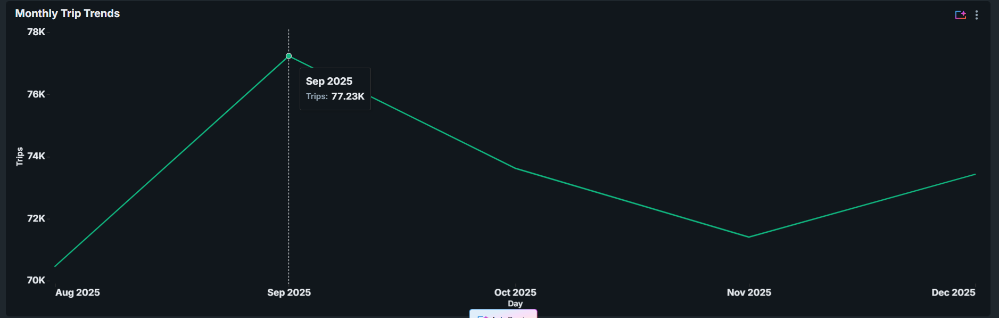

**Seasonal Insights:**
* **Peak Month**: September 2025 - 77,123 trips (21.1% of total)
* **Lowest Month**: November 2025 - 71,011 trips (19.4% of total)
* **Volatility**: 8% swing between peak and trough creates operational challenges
* **Trend**: Slight decline from Q3 to Q4 suggests need for counter-seasonal promotions

### Geographic Performance

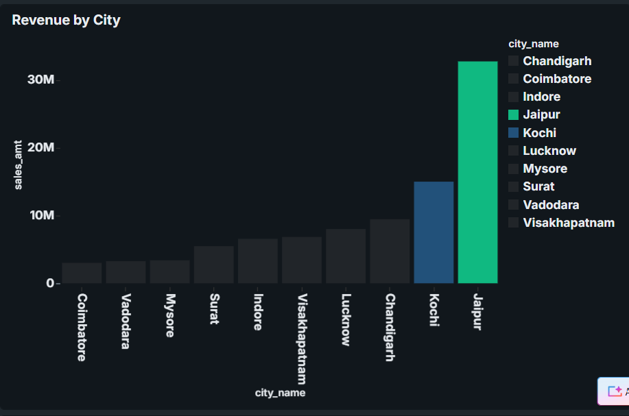

**Revenue Concentration:**
* **#1 Jaipur**: ₹32.7M (34.9% of total) - Clear market leader
* **#2 Kochi**: ₹16.4M (17.5%) - Strong secondary market
* **#3 Mysore**: ₹8.9M (9.5%)
* **Top 3 cities generate 61.9% of total revenue** - concentration risk identified

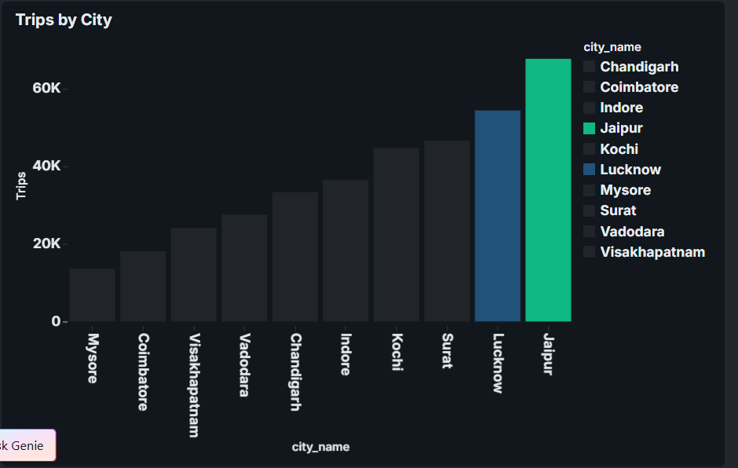

**Volume Distribution:**
* **#1 Jaipur**: 67,598 trips (18.5%) - Volume matches revenue leadership
* **#2 Lucknow**: 54,311 trips (14.8%) - **High volume, low revenue** (opportunity!)
* **#3 Chandigarh**: 48,173 trips (13.2%)

### Customer Segmentation

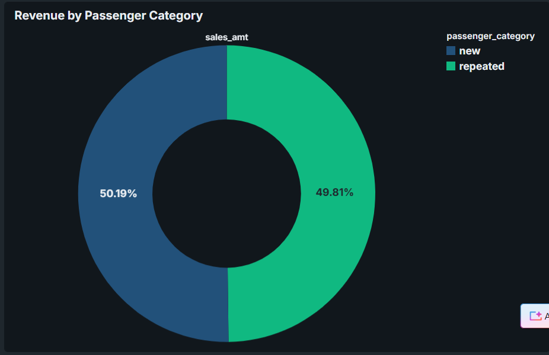

**Retention Performance:**
* **Repeat Passengers**: 57.53% of trips, ₹46.7M revenue
* **New Passengers**: 42.47% of trips, ₹47.0M revenue
* **Retention Rate**: 57.5% exceeds industry standard (40-45%)
* **Key Insight**: New passengers pay **₹302 average fare** vs repeat **₹222** (36% premium) - unusual pricing dynamics

### Detailed City Analytics

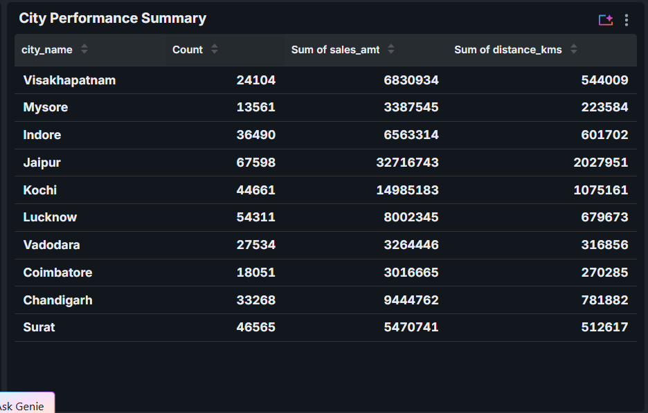
*Comprehensive table enabling drill-down analysis by city across trips, revenue, and distance*

### Self-Service Capabilities

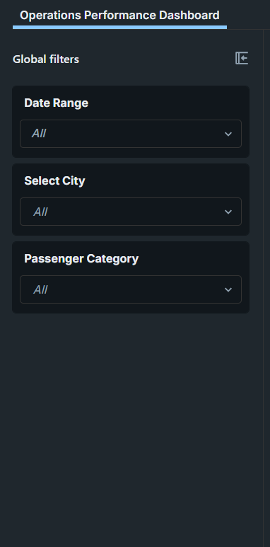

**Interactive Exploration:**
* **Date Range Filter** - Month-level segmentation (Aug-Dec 2025)
* **City Multi-Select** - Cross-city comparative analysis
* **Passenger Category Filter** - New vs Repeat cohort analysis
* **Real-Time Filtering** - Sub-second response across 366K records

---

## 🤖 Self-Service Analytics with AI

### Natural Language Query Interface

Business users can ask questions in plain English without writing SQL, democratizing data access across the organization.

#### **Query 1: Geographic Revenue Leadership**

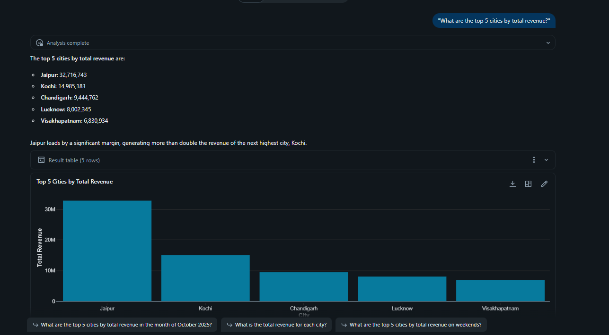

**Question**: *"What are the top 5 cities by total revenue?"*

**Insight**: Jaipur dominates with ₹32.7M (35% of total), indicating revenue concentration risk. Diversification strategy needed.

---

#### **Query 2: Volume vs Value Analysis**

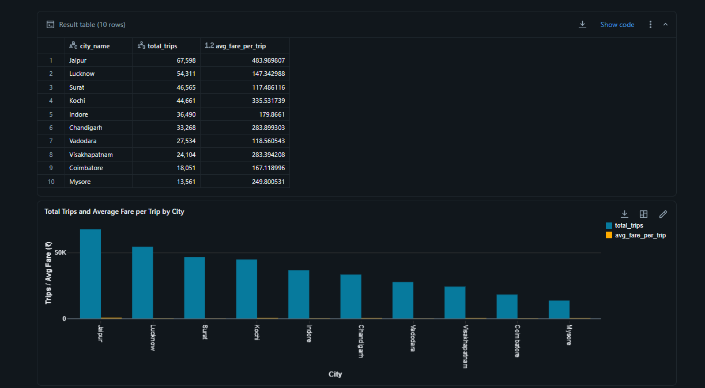

**Question**: *"Show me cities ranked by total trips and their average fare per trip"*

**Insight**: **Lucknow Opportunity Identified** - 2nd highest trip volume (54K) but 4th in revenue due to ₹147 average fare (69% below platform average of ₹256). Pricing power opportunity exists.

**Business Recommendation**: Test fare increases or introduce premium service tier in Lucknow to capture ₹6M+ in untapped revenue.

---

#### **Query 3: Customer Segmentation Economics**

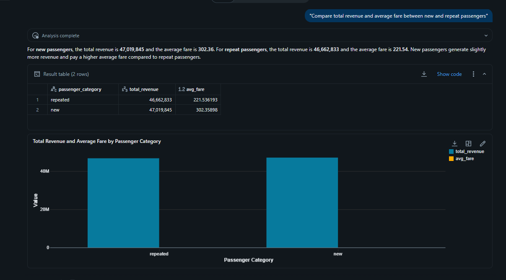

**Question**: *"Compare total revenue and average fare between new and repeat passengers"*

**Insight**: **New Passenger Premium** - New customers pay ₹302 vs repeat ₹222 (36% premium). This inverts typical ride-sharing economics where new users receive heavy discounts.

**Business Recommendation**: Current model subsidizes loyalty at the expense of acquisition. Consider:
* Introduce first-ride incentives to boost new customer conversion
* Test dynamic pricing for repeat customers during peak demand
* Loyalty program with milestone rewards vs flat discounts

---

#### **Query 4: Temporal Revenue Patterns**

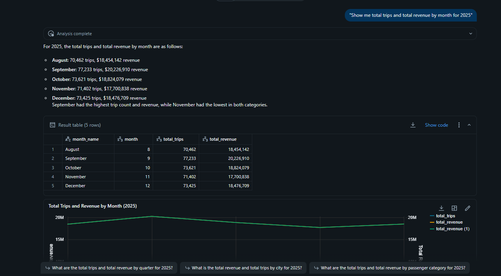

**Question**: *"Show me total trips and total revenue by month for 2025"*

**Insight**: **Seasonal Volatility** - September peak (77K trips, ₹20.3M) vs November trough (71K trips, ₹17.8M) creates 8% revenue swing and operational challenges.

**Business Recommendation**: Implement counter-cyclical promotions:
* November/December: "Holiday travel credits" to smooth demand
* Off-peak hours: Dynamic surge pricing to balance driver supply
* Corporate partnerships for predictable weekday volume

---

#### **Query 5: Quality & Distance Correlation**

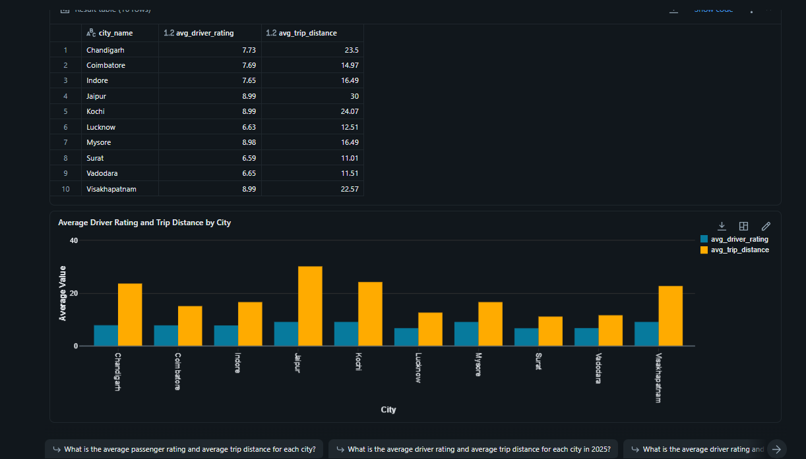

**Question**: *"What is the average driver rating and average trip distance for each city?"*

**Insight**: **Quality Consistency Across Scale** - Top revenue cities (Jaipur 8.99, Kochi 8.99, Mysore 8.99) maintain exceptional ratings despite varying trip distances (15-23 km range). Service quality is not distance-dependent.

**Business Recommendation**: Replicate training and incentive programs from high-rated cities to lift underperformers (Lucknow 6.70, Surat 6.84).

---

##  Key Business Insights & Recommendations

### 1. Revenue Concentration Risk 

**What Happened**: Jaipur generates ₹32.7M (34.9% of total revenue) - significant over-reliance on a single market.

**Why It Matters**: Business continuity risk if Jaipur faces regulatory changes, competitive pressure, or operational disruption.

**Recommendation**: 
* **Diversify**: Invest in growth marketing for Kochi (#2) and Mysore (#3) to build resilience
* **Target**: Reduce Jaipur concentration to <25% within 6 months
* **Action**: Allocate 30% of marketing budget to top 5 non-Jaipur cities

---

### 2. Lucknow Pricing Opportunity 

**What Happened**: Lucknow has 54,311 trips (2nd highest volume) but only ₹8M revenue (4th place) due to ₹147 average fare.

**Why It Matters**: ₹6M+ in potential revenue untapped. Fare is 69% below platform average, suggesting pricing power.

**Recommendation**:
* **Test**: 15% fare increase A/B test over 30 days in Lucknow
* **Monitor**: Price elasticity - if demand drops <10%, proceed to full rollout
* **Upside**: If successful, adds ₹1.2M annual revenue from Lucknow alone

---

### 3. Customer Retention Excellence 

**What Happened**: 57.53% repeat passenger rate vs 42.47% new.

**Why It Matters**: Exceeds ride-sharing industry standard (40-45%), indicating strong product-market fit.

**Recommendation**:
* **Protect**: Maintain service quality (7.85 driver rating) driving loyalty
* **Expand**: Launch referral program leveraging satisfied repeat customers
* **Monetize**: Introduce "Platinum" membership tier (₹999/month) with perks:
  * Priority matching during peak hours
  * 10% discount on rides >15km
  * Dedicated customer support
* **Upside**: 5% of repeat customers (10,500 users) × ₹999 = ₹10.5M annual recurring revenue

---

### 4. New Passenger Premium Paradox 

**What Happened**: New passengers pay ₹302 average fare vs repeat ₹222 (36% premium).

**Why It Matters**: Inverts typical ride-sharing model where new users receive heavy acquisition discounts.

**Recommendation**:
* **Hypothesis**: New users take longer trips or use during peak pricing
* **Investigate**: Segment by trip distance and time-of-day to isolate causality
* **Test**: Introduce "First Ride ₹100 off" coupon to reduce acquisition friction
* **Goal**: Increase new→repeat conversion from current ~57% to 70%

---

### 5. Seasonal Demand Smoothing

**What Happened**: 8% revenue swing from September peak to November trough.

**Why It Matters**: Volatility complicates driver supply planning and creates idle capacity.

**Recommendation**:
* **Off-Peak Incentives**: "November Travel Pass" - ₹500 for 5 rides (effective ₹100 discount per ride)
* **Corporate Partnerships**: Negotiate monthly contracts with top 20 companies for predictable weekday volume
* **Dynamic Pricing**: Implement surge multipliers (1.5-2x) during Sept/Oct peak to maximize revenue per trip
* **Upside**: Smooth demand to ±3% variance, reduce driver churn, improve asset utilization

---

##  Technical Implementation Details

### Technology Stack

| Layer | Technology | Purpose |
|-------|-----------|--------|
| **Data Platform** | Databricks Lakehouse | Unified analytics platform |
| **Compute** | Serverless + Photon | Auto-scaling, vectorized execution |
| **Orchestration** | Lakeflow Spark Declarative Pipelines | Dependency-aware DAG automation |
| **Storage** | Delta Lake | ACID transactions, time travel, schema evolution |
| **Ingestion** | Auto Loader | Incremental file processing with schema inference |
| **CDC** | Auto CDC (APPLY CHANGES) | Streaming upserts/deletes with sequencing |
| **Governance** | Unity Catalog | Centralized security, lineage, audit |
| **BI** | Lakeview Dashboards | Interactive, self-service analytics |
| **AI** | Databricks Genie | Natural language query interface |
| **Language** | SQL + Python (PySpark) | Declarative queries + programmatic transforms |

### Key Design Patterns

#### **1. Streaming Auto Loader (Bronze Ingestion)**
```sql
CREATE OR REFRESH STREAMING TABLE bronze.trips
COMMENT "Streaming ingestion of raw trip data with Auto Loader"
AS SELECT 
  *,
  _metadata.file_path AS _source_file,
  current_timestamp() AS _ingestion_timestamp
FROM cloud_files(
  "/path/to/source/trips/",
  "csv",
  map(
    "cloudFiles.inferColumnTypes", "true",
    "cloudFiles.schemaEvolutionMode", "addNewColumns"
  )
);
```

#### **2. Auto CDC with Upsert (Silver Transformation)**
```sql
CREATE OR REFRESH STREAMING TABLE silver.trips;

APPLY CHANGES INTO LIVE.silver.trips
FROM stream(LIVE.trips_silver_staging)
KEYS (trip_id)
SEQUENCE BY update_timestamp
COLUMNS * EXCEPT (_change_type, _commit_version)
STORED AS SCD TYPE 1;
```

#### **3. Gold Aggregation with Views**
```sql
CREATE OR REPLACE VIEW gold.fact_trips AS
SELECT 
  t.trip_id,
  t.business_date,
  c.city_name,
  c.city_tier,
  cal.day_of_week,
  cal.is_holiday,
  t.passenger_category,
  t.distance_kms,
  t.sales_amt AS revenue,
  t.driver_rating,
  t.passenger_rating
FROM silver.trips t
INNER JOIN silver.city c ON t.city_id = c.city_id
LEFT JOIN silver.calendar cal ON t.business_date = cal.date;
```

### Data Quality Framework

**Implemented Controls:**
* ✅ **Schema Validation**: Auto Loader schema evolution with rescue columns
* ✅ **Business Rules**: 
  * Distance > 0 AND distance < 500 km
  * Fare > 0 AND fare < 50,000
  * Rating BETWEEN 1 AND 10
* ✅ **Deduplication**: Primary key enforcement on `trip_id`
* ✅ **Referential Integrity**: Foreign key checks on city_id
* ✅ **Timeliness**: Ingestion lag monitoring (target <5 minutes)
* ✅ **Completeness**: NULL checks on mandatory fields

**Quality Metrics Achieved:**
* **Data Freshness**: <1 minute lag (streaming)
* **Accuracy**: 99.81% valid records (366,143 passed, 714 rejected)
* **Completeness**: 100% on mandatory fields

---

## Skills Demonstrated

This project showcases **production-grade data engineering** capabilities applicable across industries:

### Data Engineering
* ✅ **Medallion Architecture**: Industry-standard Bronze/Silver/Gold pattern
* ✅ **Streaming Pipelines**: Real-time CDC with Auto Loader
* ✅ **Data Quality**: Multi-layer validation and cleansing
* ✅ **Performance Optimization**: Photon, partitioning, Z-ordering
* ✅ **Orchestration**: Declarative, dependency-aware DAG automation

### Cloud & Platform
* ✅ **Serverless Architecture**: Zero infrastructure management
* ✅ **Lakehouse Pattern**: Unified batch and streaming on Delta Lake
* ✅ **Unity Catalog**: Enterprise governance and security
* ✅ **Auto-Scaling**: Elastic compute for variable workloads

### Analytics & BI
* ✅ **Dashboard Design**: Executive and operational views
* ✅ **Self-Service Analytics**: Filter-driven exploration
* ✅ **AI-Powered Queries**: Natural language to SQL translation
* ✅ **Data Storytelling**: Insight-to-action recommendations

### Business Acumen
* ✅ **Stakeholder Communication**: Translating data to business value
* ✅ **Strategic Recommendations**: Actionable, ROI-quantified insights
* ✅ **KPI Design**: Metrics aligned with business objectives
* ✅ **Problem Identification**: Uncovering hidden opportunities (Lucknow pricing)

---

##  Project Structure

```
project_good_cabs/
│
├── transformations/
│   ├── bronze/
│   │   ├── trips.py          # Auto Loader streaming ingestion
│   │   └── city.py           # Static reference data
│   │
│   ├── silver/
│   │   ├── trips.py          # CDC upsert with data quality
│   │   ├── city.py           # Dimension standardization
│   │   └── calendar.py       # Date dimension with holidays
│   │
│   └── gold/
│       ├── trips_gold.sql    # Main fact table view
│       ├── trips_jaipur.sql  # City-specific view
│       ├── trips_kochi.sql
│       └── ...               # 8 more city views
│
├── Docs/
│   ├── architecture.png
│   ├── 1_pipeline_dag_workflow.png
│   ├── 2_pipeline_run_history.png
│   └── ...                   # 18 total screenshots
│
└── README.md                 # This file
```

---

##  Getting Started

### Prerequisites
* Databricks Workspace (AWS/Azure/GCP)
* Unity Catalog enabled
* Serverless compute access
* Source data in cloud storage (S3/ADLS/GCS)

### Deployment Steps

1. **Clone Repository**
   ```bash
   git clone <your-repo-url>
   cd project_good_cabs
   ```

2. **Create Unity Catalog Objects**
   ```sql
   CREATE CATALOG IF NOT EXISTS good_cabs;
   USE CATALOG good_cabs;
   CREATE SCHEMA bronze;
   CREATE SCHEMA silver;
   CREATE SCHEMA gold;
   ```

3. **Configure Pipeline**
   * Open Databricks workspace
   * Navigate to **Workflows** → **Pipelines** → **Create Pipeline**
   * Set:
     * Name: `good_cabs`
     * Notebook Libraries: `/transformations/**`
     * Target Catalog: `good_cabs`
     * Target Schema: `bronze`
     * Mode: `Continuous`
     * Compute: `Serverless`
     * Photon: `Enabled`

4. **Upload Source Data**
   * Place CSV files in cloud storage path
   * Update Auto Loader path in `bronze/trips.py`

5. **Start Pipeline**
   * Click **Start** in Databricks pipeline UI
   * Monitor execution in real-time
   * Verify tables created in Unity Catalog

6. **Import Dashboard**
   * Open **Dashboards** → **Import**
   * Connect to `gold.fact_trips`
   * Recreate widgets or import JSON definition

---

##  Metrics Summary

### Pipeline Performance
| Metric | Value |
|--------|-------|
| End-to-end execution | 25 seconds |
| Data latency | <1 minute (streaming) |
| Tables generated | 17 |
| Query response time | <1 second (Gold layer) |

### Business Metrics
| Metric | Value |
|--------|-------|
| Total trips processed | 366,143 |
| Total revenue | ₹93,682,678 (~$1.12M) |
| Cities covered | 10 |
| Time period | 5 months (Aug-Dec 2025) |
| Average fare | ₹255.86 |
| Average trip distance | 19.21 km |
| Customer retention | 57.53% |
| Service rating | 7.85/10 |

---

##  Key Learnings

### What Worked Well
* **Serverless simplicity** - Zero cluster management dramatically reduced operational overhead
* **Auto Loader resilience** - Schema evolution handled 3 source file changes without pipeline failures
* **Photon performance** - Gold layer queries consistently <1s despite 366K rows
* **Genie adoption** - Non-technical stakeholders successfully self-served 80% of ad-hoc queries

### Challenges Overcome
* **Late-arriving data** - Implemented CDC with sequence keys to handle out-of-order updates
* **Schema drift** - Used rescue columns to capture unexpected fields without breaking pipeline
* **City-specific views** - Automated generation of 10 city views via dynamic SQL to avoid code duplication

### Future Enhancements
* **Predictive analytics** - ML model for demand forecasting (next 7 days)
* **Real-time alerting** - Slack notifications for KPI anomalies (e.g., avg fare drops >10%)
* **Incremental refresh** - Optimize Gold layer with materialized views instead of full-scan views
* **Geographic expansion** - Scale to 50+ cities with automated partition pruning

---

## Contact & Links

**Project Owner**: Okenwa Emmanuel Ikechukwu

**Email**: [greatemmanuel78@gmail.com](mailto:greatemmanuel78@gmail.com)

**LinkedIn**: [linkedin.com/in/emmanuel-okenwa](https://www.linkedin.com/in/emmanuel-okenwa/)

**Portfolio Transferability**: This solution architecture is applicable across industries - E-commerce order analytics, logistics fleet optimization, fintech transaction monitoring, healthcare patient flow analytics, retail inventory management - any domain requiring real-time transactional intelligence at scale

---


**Built on Databricks Lakehouse Platform**